# Continuous Integration Pipeline For Tooling Website


## Table of Contents
- Introduction.
    - What is Jenkins?
    - Why Jenkins?
- Prerequisites.
- Installing and Configuring Jenkins Server.
    - Configure Jenkins to retrieve source code from GitHub using Webhooks.
- Configure Jenkins to copy files to the NFS server via ssh.

### Introduction
The previous projects allow us to add new web servers to our project and set up a load balancer to distribute the traffic between them. However, we still need to manually copy the files to the web servers. This project would allow us to automate the task of configuring multiple web servers.

In the world of software development, agility and speed of software solutions delivery are key factors. To achieve this, we need to automate as much as possible, as that would guarantee fast and repeatable deployments. In this project, we will start by automating part of our routine tasks with a free and open-source tool called Jenkins.
This process is very much wrapped around the concept of <b>Continous Integration (CI)</b>.
CI is a software development practice where developers integrate code into a shared repository frequently, preferably several times a day. Each integration can then be verified by an automated build and automated tests. CD is a software release process that uses automated testing to validate if changes to a codebase are correct and stable for immediate autonomous deployment to a production environment.

#### What is Jenkins?
Jenkins is a self-contained, open-source automation server that can be used to automate all sorts of tasks related to building, testing, and delivering or deploying software. Jenkins is written in Java and it is an open-source tool. Jenkins is a continuous integration tool. It is used to build and test your software projects continuously making it easier for developers to integrate changes to the project, and making it easier for users to obtain a fresh build. It also allows you to continuously deliver your software by integrating with a large number of testing and deployment technologies.

Jenkins can be installed through native system packages, Docker, or it can also run standalone on any machine with the java runtime environment installed.

#### Why Jenkins?
Jenkins is a continuous integration tool. It makes it easier for thousands of developers around the world to reliably build, test, and deploy their software. As it helps keep track of the version control system and initiate and monitor a build system if there are any changes.

In this project, we are going to utilize Jenkins CI capabilities to make sure that every change made to the source code in GitHub is automatically updated on the web servers.

### Prerequisites
- Source Code: <a href="https://github.com/manny-uncharted/tooling.git">GitHub</a>
- Infrastructure: AWS.
- Webserver Linux: Red Hat Enterprise Linux 8.
- Database Server: Ubuntu 20.04 + MySQL.
- Storage Server: Red Hat Enterprise Linux 8 + NFS Server.
- Load Balancer: Ubuntu 20.04.
- Programming Language: PHP.

To configure the above steps refer to the previous tutorial <a href="https://github.com/manny-uncharted/configuring-apache-as-a-load-balancer.git">Here</a>

<b>Task:</b> Enhance the architecture in the previous project by adding a Jenkins server, and configure a job to automatically deploy source code changes from Git to the NFS server.


### Installing and Configuring Jenkins Server
#### Install Jenkins on the Jenkins server.
- Create an AWS EC2 server based on Ubuntu Server 20.04 LTS and name it "Jenkins".

Results:
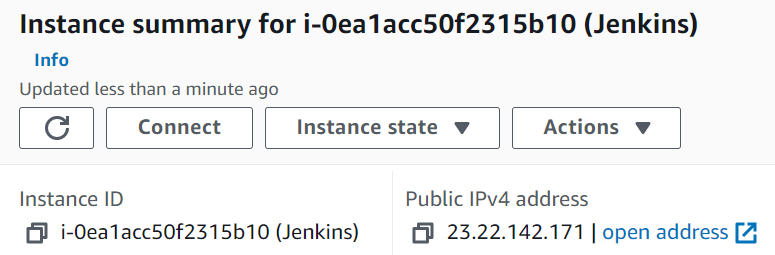

- Install JDK (Java Development Kit) on the Jenkins server. Since Jenkins is a Java-based application.
```
sudo apt update
sudo apt install default-jdk-headless
```

Results:
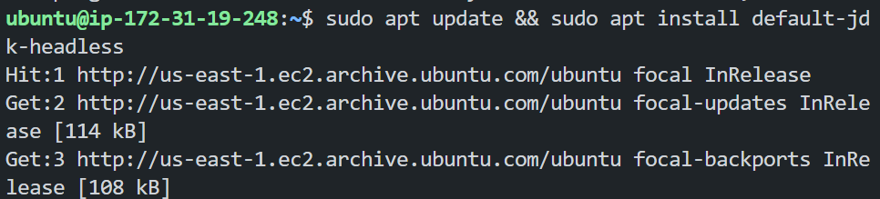

- Install Jenkins
```
wget -q -O - https://pkg.jenkins.io/debian-stable/jenkins.io.key | sudo apt-key add -
sudo sh -c 'echo deb https://pkg.jenkins.io/debian-stable binary/ > \
    /etc/apt/sources.list.d/jenkins.list'
sudo apt update
sudo apt-get install jenkins
```

Results:
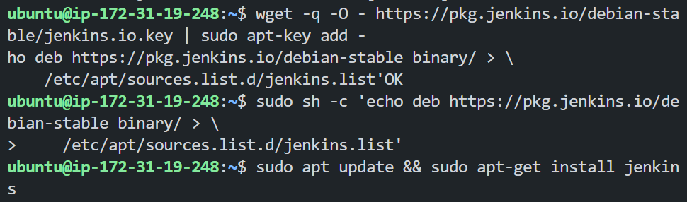

- We have to make sure that Jenkins is running.
```
sudo systemctl status jenkins
```

Results:
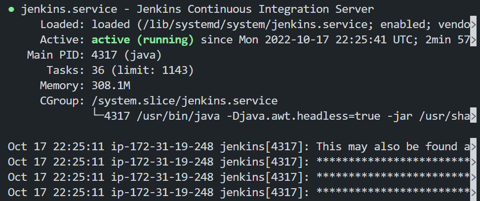

- By default Jenkins server uses TCP port 8080 - open it by creating a new inbound rule in your EC2 security group.

Results:
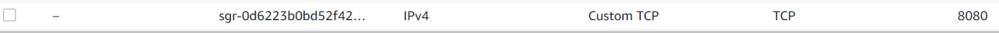

- Perform initial Jenkins setup. From your browser access.
```
http://<Jenkins-Server-Public-IP-Address>:8080
```

Results:
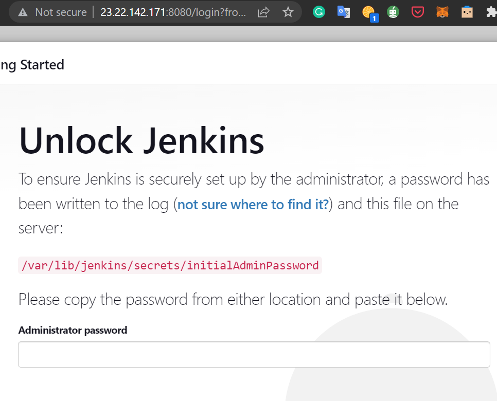

<b>Note</b>:You will be prompted to provide a default admin password.

- To get retrieve the default admin password, run the following command.
```
sudo cat /var/lib/jenkins/secrets/initialAdminPassword
```

Results:
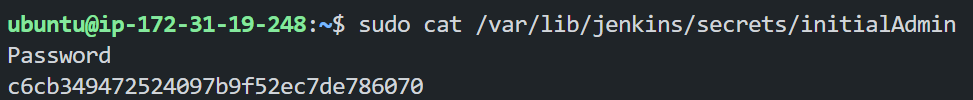

- Then you will be asked which plugins to install - choose suggested plugins.

Results:
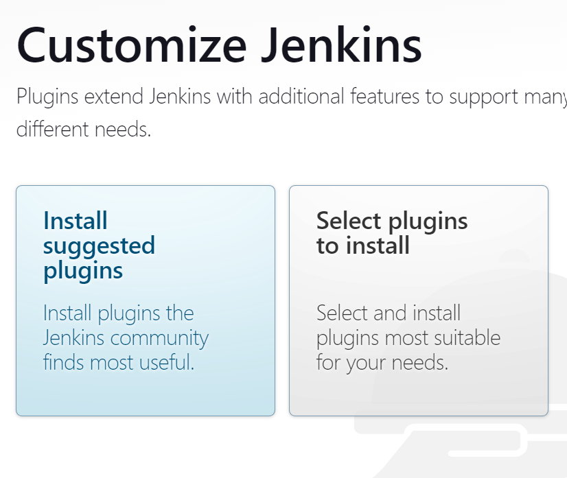

- Once plugin installation is done - create an admin user and you will get your Jenkin server address.

Results:


#### Configure Jenkins to retrieve source code from GitHub using Webhooks.
Here we will configure Jenkins to automatically retrieve source code from GitHub whenever there is a change in the source code. This would be done by using Webhooks.

- Enable webhooks in your GitHub repository settings. Go to your GitHub repository and click on Settings > Webhooks > Add webhook.

Results:
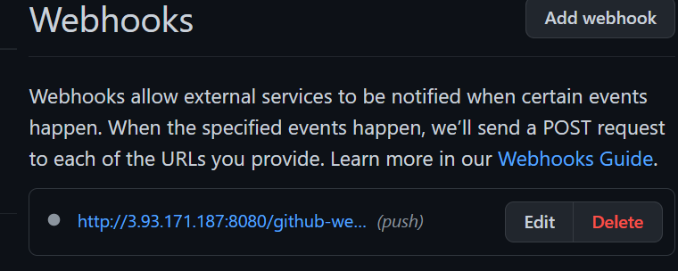

- Go to Jenkins web console, click "New Item" and create a Freestyle project.

Results:
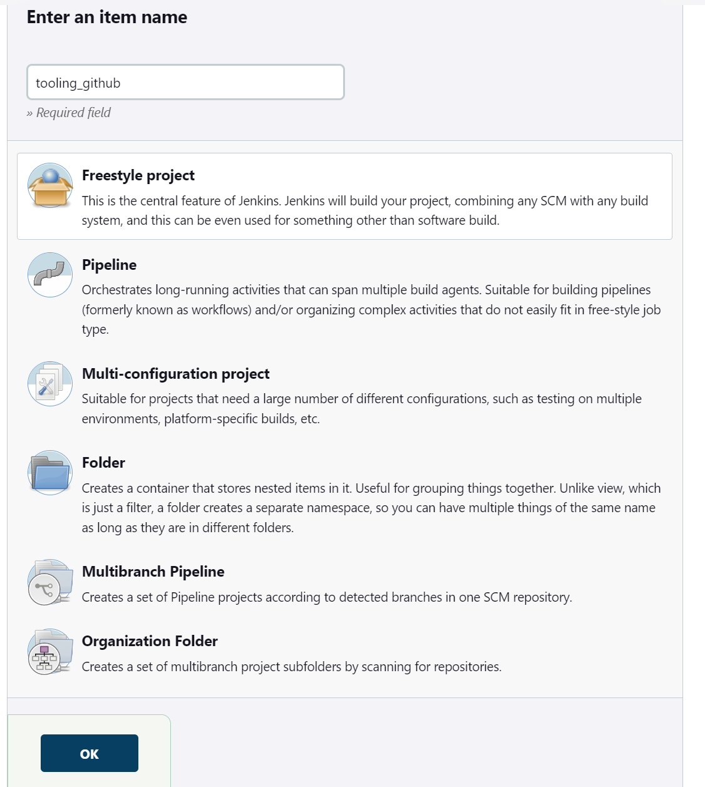

- To connect your GitHub repository to Jenkins, you will need to provide its URL, just copy the URL from your GitHub repository.

Results:
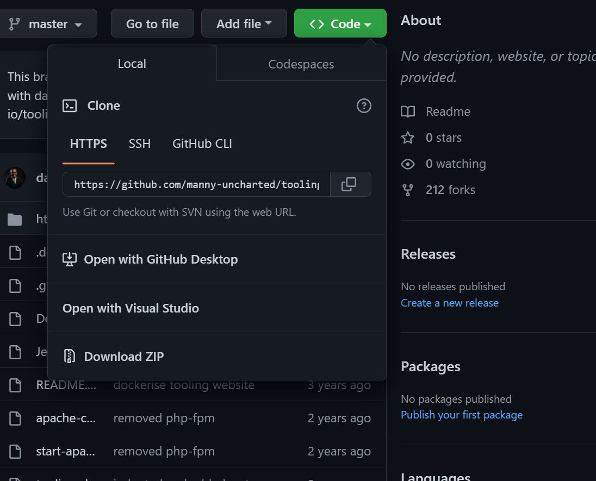

- In your Jenkins project, the configurations, choose Git repository, provide the URL of your GitHub repository and click on "Add" to add the credentials, so Jenkins can access your GitHub repository.

Results:
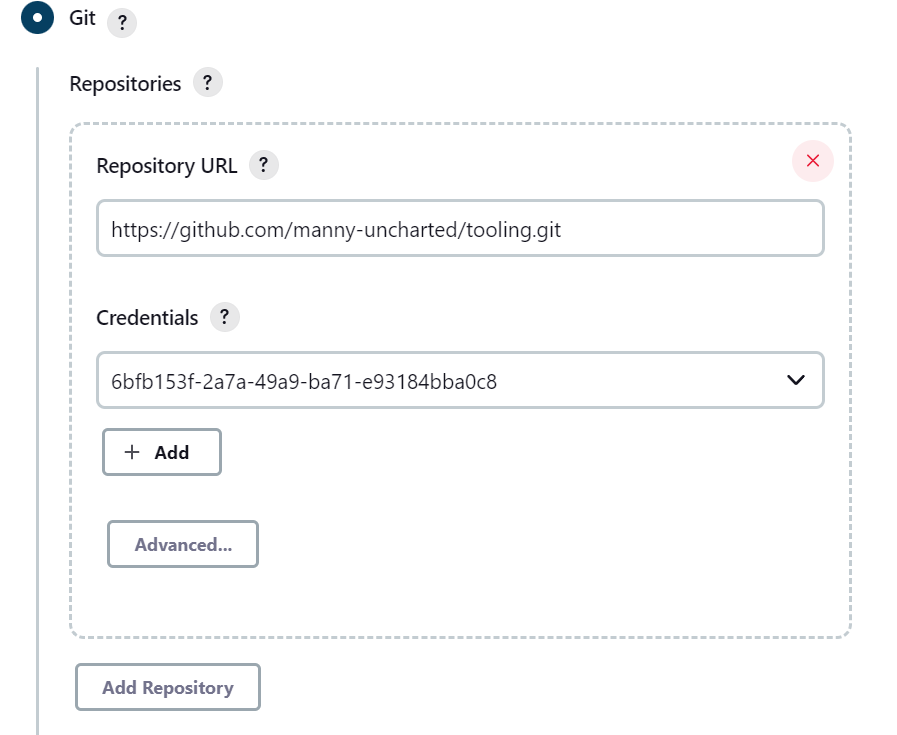

Save the configurations and lets try to run the build. Click on "Build Now" and you will see the build is successful.
